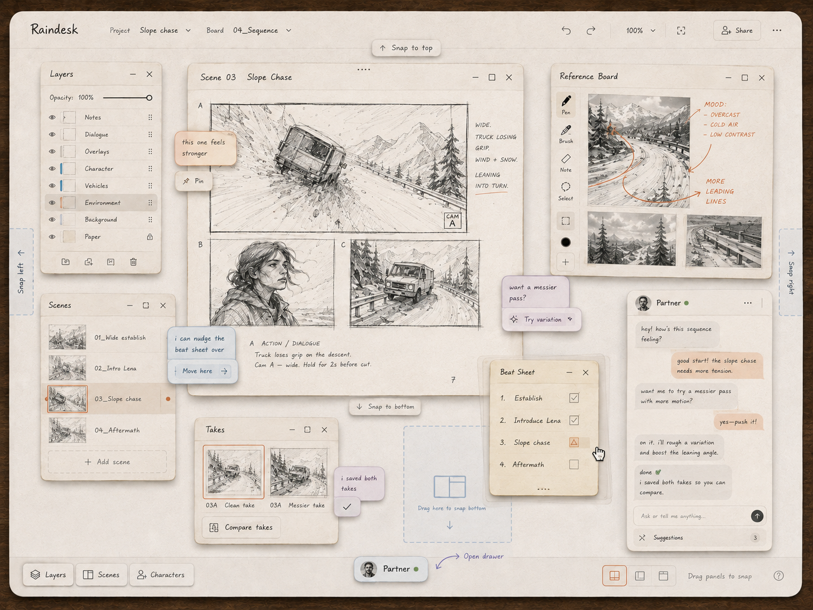

# Owner concept — the Raindesk desk (2026-08-19) · **current visual direction**

**Provenance.** Owner-made concept image, file dated 2026-08-19 on the owner's laptop (`~/Downloads/a2d43e85-0203-46e7-a027-3e6b806aca22.png`), brought into the repo on 2026-09-05 at the owner's request. 1448×1086 PNG, sha256 prefix `05cc46bfe3f9456d`.

**Status.** This is the most recent concept design of the app and, in the owner's words, *"the closest one so far to hitting my personal mental itch. dynamic, non-rigid."* It supersedes `../companion-app-v1/` (the dark phone mockup the v1 build followed) as the look to build toward.

## The owner's direction (verbatim, 2026-09-05)

> The goal is for the user to only do the correction, with the bulk of it controlled by the agent, at least the visual generations or starting to get things rolling anyways. It's gonna be a thing where most of it is chatting with the agent to nail down concept and designs and have the agent generate and the user there to refine. So both the user and the agent are working with a baseline of comprehensive documents like our 'the held sky' design documentation to start with.

## What the image shows (the grammar to carry)

- **Ground:** a warm paper desk on a dark wooden table edge; every surface is a paper card with a soft shadow, hand-written labels, and rust/orange as the only active accent.
- **Floating paper panels, freely arranged:** Layers (opacity, eye toggles, grip handles, a locked Paper layer), Scenes (thumbnail list 01–04, "Add scene"), **Scene 03 · Slope Chase** storyboard sheet (panels A/B/C, hand-written shot notes "WIDE. TRUCK LOSING GRIP. WIND + SNOW. LEANING INTO TURN.", a CAM A badge, an action/dialogue line, a page number), **Reference Board** (pen / brush / note / select / colour tools down its left edge, annotated references with hand-drawn arrows and mood notes), **Takes** (03A Clean take · 03A Messier take, "Compare takes"), **Beat Sheet** (checklist 1–4 with a warning tick on the active beat), **Partner** chat (avatar, presence dot, a short exchange, "Ask or tell me anything…", a **Suggestions** tray with a count).
- **Snapping, not rigid layout:** "Snap to top / bottom" and "Snap left / right" edge zones, a dashed "Drag here to snap bottom" target, and a "Drag panels to snap" hint in the bottom bar; layout toggles bottom-right.
- **The agent speaks in sticky notes on the desk, not only in chat:** "this one feels stronger → Pin", "i can nudge the beat sheet over → Move here", "want a messier pass? → Try variation", "i saved both takes ✓". The Partner proposes; the owner accepts with one tap.
- **Bottom bar:** Layers · Scenes · Characters buttons and a Partner button ("Open drawer"); header carries project and board pickers, undo/redo, zoom and share.
- **Type:** hand-written for labels and notes, plain humanist sans for chat; sketch-ink storyboard imagery.

## What this means for the build

The v1.1 desk (dark rain-teal stage, floating icon rail) does not match this. The freeform desk v2 window manager already provides the floating/snapping panel model on the v4 workspace protocol; what is missing is the **paper visual language** planned in `raindesk/FREEFORM_DESK_V2.md` (phase 5, unbuilt) and the **agent-on-the-desk** sticky-note proposals (the Partner action ledger already exists to back them). Next step per the project's own rule: a phone-first and desktop mockup in this grammar for owner ratification, then the restyle.
